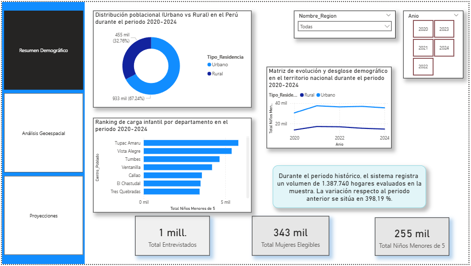

# 📊 Análisis de Datos con Power BI

## Vista previa del Dashboard

## Descripción

Este proyecto analiza información demográfica de Áncash mediante Power BI.

## Herramientas utilizadas

- Power BI Desktop
- Power Query
- DAX
- Excel

## Contenido

- TRABAJO DE POWER BI.pbix
- dashboard.png
- README.md

## Autor

EC
